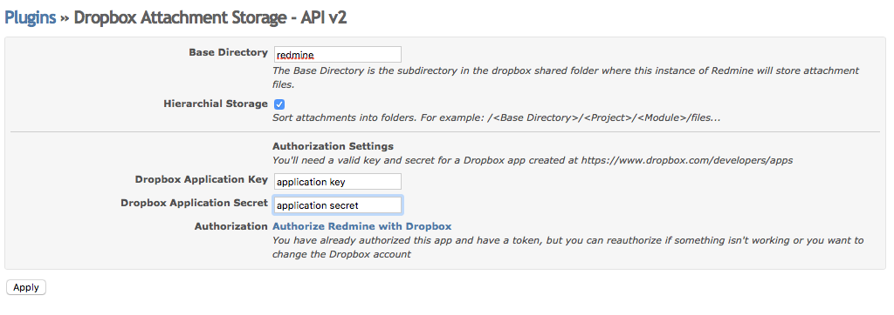

Use [Dropbox](http://www.dropbox.com) as the storage backend for your [Redmine](http://www.redmine.org) installation.

## Installation

To install the plugin, execute the following commands from the root of your Redmine directory:
    
    cd plugins
    git clone git://github.com/alexbevi/redmine_dropbox_attachments.git
    bundle install

More information on installing Redmine plugins can be found at [redmine.org](http://www.redmine.org/wiki/redmine/Plugins.).

After the plugin is installed you will need to restart Redmine for the plugin to be available.

### Compatiblity

This plugin has been tested against [Redmine](http://www.redmine.org) 2.0+. 

Though it "should" be capable of working with older (1.x) versions, no guarantees will be made ;)

### Uninstallation

To remove the plugin, from the root of your installation directory do the following:

    rm -rf plugins/redmine_dropbox_attachments
    bundle install

## Configuration

The plugin must be configured from `Administration > Plugins > Dropbox Attachment Storage > Configure`

### Authorization

Before Redmine can store files on a shared Dropbox folder, it must be authorized. This is done by clicking _Authorize Redmine with Dropbox_, then selecting _Allow_ from Dropbox's authorization page.

### Specifying a Base Directory

By default, the plugin will write to your Dropbox's `Apps > redmine_files` directory.

If you specify a *Base Directory* value, that subdirectory will be creted under Apps/redmine_files and used to store attachements for the plugin.

### Storing Attachments in a Project Hierarchy

If this option is checked, files will be stored in a folder structure in the format of:

    /base
      /project
        /module
          file
          file
          file

This makes it easier to locate an attachment directly on Dropbox as there is a bit more context to the stored content.      

### Storing Attachments for Multiple Redmine Installations

Since you can only register a single instance of this plugin with Dropbox, if you want to store attachments for multiple installations of Redmine, the steps are:

1) Authorize the plugin _ONCE_ with Dropbox

2) Copy the _Dropbox Token_ and _Dropbox Secret_ values from the authorized installation

3) Paste the token/secret values to each additional installation

Note that if you have multiple installations, it's a good idea to specify different base directories. If you happen to use the same project-identifiers across installations, the plugin will not be able to differentiate which installation a file should belong to.

## Acknowledgement

This plugin is heavily based on the [Redmine S3](https://github.com/tigrish/redmine_s3) plugin. Thanks to all the contributors there who've made this such an easy plugin to build ;)

I also used the [Redmine DropBox](https://github.com/zuinqstudio/redmine_drop_box) plugin to find some quick answers to interacting with dropbox.

### Thanks

Big thanks to [Alexander Nickel](https://github.com/mralexandernickel) for the initial implementation of the project folder hierarchy.

## Notes

Ruby 1.9+ is required in order for this plugin to work properly. Using Ruby 1.8.7 will result in

    NoMethodError (undefined method `<=>' for :root:Symbol)

when trying to delete an object (File, Issue, Document ... etc) that has an attachment.

### Issues Upgrading from v2.0.0

This version ignored the value of *Base Directory* and instead used a string value of "false". Just copy the files from "false" to the desired directory.

## About

Copyright (c) 2012-2013 Alex Bevilacqua

Permission is hereby granted, free of charge, to any person obtaining
a copy of this software and associated documentation files (the
"Software"), to deal in the Software without restriction, including
without limitation the rights to use, copy, modify, merge, publish,
distribute, sublicense, and/or sell copies of the Software, and to
permit persons to whom the Software is furnished to do so, subject to
the following conditions:

The above copyright notice and this permission notice shall be
included in all copies or substantial portions of the Software.

THE SOFTWARE IS PROVIDED "AS IS", WITHOUT WARRANTY OF ANY KIND,
EXPRESS OR IMPLIED, INCLUDING BUT NOT LIMITED TO THE WARRANTIES OF
MERCHANTABILITY, FITNESS FOR A PARTICULAR PURPOSE AND
NONINFRINGEMENT. IN NO EVENT SHALL THE AUTHORS OR COPYRIGHT HOLDERS BE
LIABLE FOR ANY CLAIM, DAMAGES OR OTHER LIABILITY, WHETHER IN AN ACTION
OF CONTRACT, TORT OR OTHERWISE, ARISING FROM, OUT OF OR IN CONNECTION
WITH THE SOFTWARE OR THE USE OR OTHER DEALINGS IN THE SOFTWARE.

#### Shameless Plug(s)

If you like this plugin, feel free to endorse me ;) 

